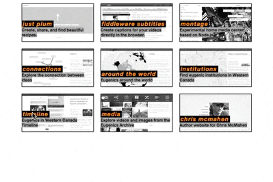

react-cast
=====================



Make beautiful, animated grid-layouts. Check out the example for advanced usage. This is an early release, so expect more documentation, examples, and tests, soon.

## Install
```
$ npm install react-cast
```

## Example

```javascript
var Grid = require('react-cast')
var React = require('react')

var GridContainer = React.createClass({

  render() {
    return (
      <Grid
        width={100}
        height={100}
        columnCount={2}>
          <div key='a'>A</div>
          <div key='b'>B</div>
          <div key='c'>C</div>
      </Grid>
    )
  }
})
```

## Prior-art

This is based on an example provided in the [react-motion repo](https://github.com/chenglou/react-motion).
